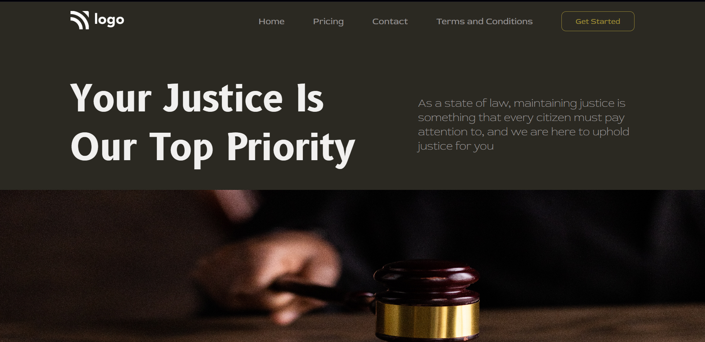

# Assignment 1

## Project 3 [Live Link](https://62e2b8c96fe1bf43e077452a--chic-salmiakki-14498a.netlify.app/)

-   Skills Gained in this project
    -   Learned about hovering styling effect on elements.
    -   Learned about flexbox.

---

## Time taken to finish this project

-   Approximately 5-6 hour taken to complete this one.

#### Screenshot

